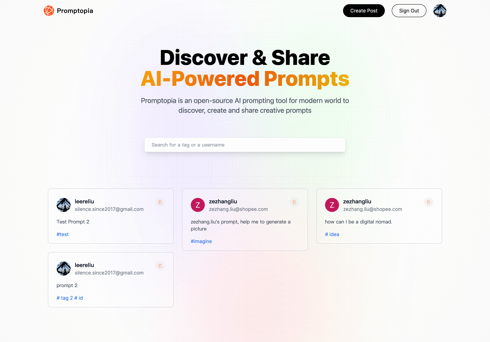

## Next 13 Demo Application

in this demo application, I use

- Next.js 13 App Folder Structure
- Next.js 13 Client Components vs Server Components
- Next.js 13 ServerFile-based Routing (including dynamic and nested routes)
- Next.js 13 page, layout, loading, and error Special Files
- Next.js 13 Serverless Route Handlers (Next API, Full Stack Apps)
- Next.js 13 Metadata and Search Engine Optimization (SEO)
  Three ways to fetch data in Next.js:
  - Server Side Rendering (SSR),
  - Static Site Generation (SSG)
  - Incremental Static Generation (ISR)

Feel free to access **https://promptopia-tenderne.vercel.app**
